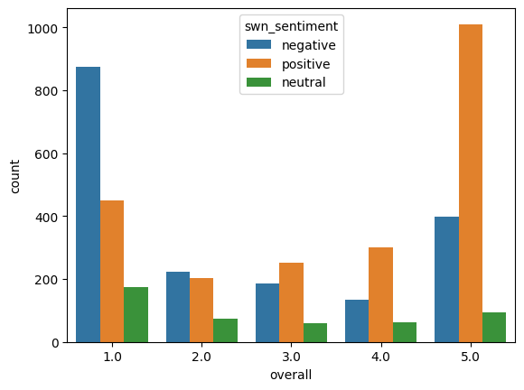
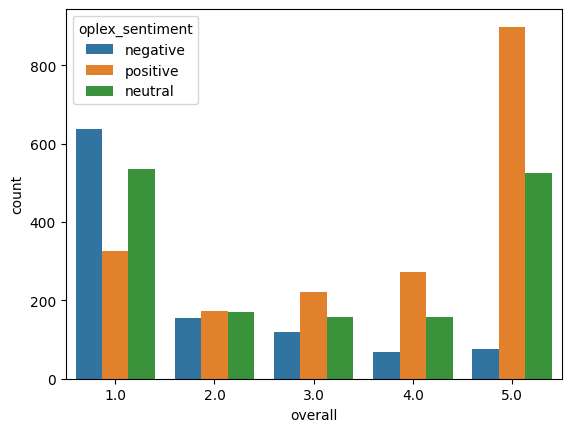

# Sentiment Analysis and Natural Language Processing for Marketing

## Project Outline

This project works on analyzing the sentiment of the reviews of the users for video games
various sentiment model is used for anlysing the sentiment of the reviews.

The NLTK package is used to tokenize and generate the sentiment for the dataset.

## Results

## Dataset

The Amazon review dataset can be downloaded from [here](https://nijianmo.github.io/amazon/index.html). Download the zipped json file of the category of video games 5 core, which can be found under the title Small subsets for experimentation. Once the download is complete, extract the file.
